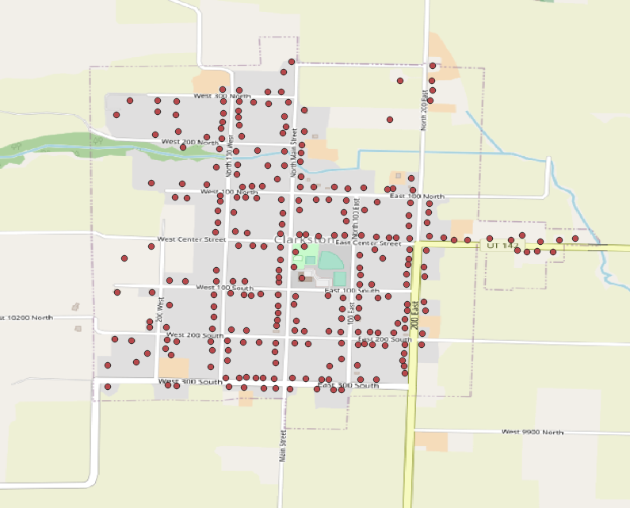

# OpenStreetMap Address Import - Cache Valley, UT

Setup for importing address points from Utah's dataset to OpenStreetMap. 

## Scope

This should work anywhere in Utah with minimal changes. However, there are surely some issues that will arise in areas outside of Cache Valley, I haven't tested this anywhere else!

Some issues may occur when using this on more "squiggly" roads since I made some assumptions about the grid system when writing the translation functionality. TODO: More testing should reveal what fixes need to be made.

## Procedure

0. Community Prerequisites
    - Follow standard procedure for OSM imports:
      - [OSM Wiki - Imports](https://wiki.openstreetmap.org/wiki/Import)
      - [OSM Wiki - Import Guidelines](https://wiki.openstreetmap.org/wiki/Import/Guidelines)
      - [OSM Wiki - Automated Edits Code of Conduct](https://wiki.openstreetmap.org/wiki/Automated_Edits_code_of_conduct)
1. Download Data - Address Points dataset from [UGRC](https://gis.utah.gov/data/location/address-data/) (Shapefile or GeoDatabase will do, I think)
2. Software Prerequisites
    - This Script - Provides "translation" functionality
    - [QGIS](https://www.qgis.org/en/site/) - Desktop GIS Software
    - [`ogr2osm`](https://pypi.org/project/ogr2osm/), allows conversion from many formats to OSM features
    - [JOSM](https://josm.openstreetmap.de/) - Desktop OSM Editor
    - [Conflation](https://wiki.openstreetmap.org/wiki/JOSM/Plugins/Conflation) - JOSM Plugin to combine with existing data
3. Narrow Dataset
    - In QGIS, open data source, select AddressPoints downloaded from UGRC.
    - Add an OSM raster base layer if you want. Not necessary, it just helps me get my bearings.
    - Right-click on AddressPoints layer, hit filter, choose a city and apply the filter. Click OK.
    - 
    - Right-click on now filtered AddressPoints layer, then Export. I think a few different formats should work, but I left it on GeoPackage. Choose a filename, the rest of the options should be OK at default.
4. Translate tags
    - After downloading this script, open it up and pick the right path for the exported city address points file. (TODO: Add ability to just pass it in)
    - Run the script. Output file will be the same filename but with `.osm` extension.
    - Watch for warnings/errors in console. The script should add FIXME tags to anything that might have an issue.
5. Inspect Output
    - Launch JOSM, open the `.osm` file. Hit ctrl+A to select all points, and look at the tag inspector for anything that looks out of place.
    - You can do a search for `fixme=*` to check out any issues and fix before uploading.
6. Handle Conflation (See [conflation usage](https://wiki.openstreetmap.org/wiki/JOSM/Plugins/Conflation#Usage))
    - In JOSM, download the relevant OSM data for the area.
    - Show the Conflation panel. Click Configure there. 
    - Select all data to be imported, then "freeze" it under the **reference** section.
        - The translation script will assign a "UGRC:address_type" tag, "primary" addresses are more likely to be good merge candidates for buildings.
        - If desired, select import data, do a search for "UGRC:address_type"=primary before freezing reference selection.
    - Select the relevant data to be merged *into* (existing OSM data), then freeze under **subject**.
        - See [sample list of features](josm_features.txt) for a good starting point search.
    - Click Generate Matches. In the Conflation panel, review matches.
        - You can sort by distance to initially weed out questionable items.
        - You can sort by conflict to work those out before proceeding.
        - You can select one or many features on the map, then click Conflate or Remove to approve or deny their corresponding conflation operations.
    - Reference Only items can usually be conflated (read: added to subject layer) without too much trouble.
    - Subject Only items can usually be left alone.
    - Conflation step is the most critical step in lining things up correctly. Don't rush!
7. Upload to OSM

Include the following tags in your changeset:

```
import=yes
mechanical=yes
created_by=___
source=Utah AGRC
comment=Import addresses from Utah's dataset
description=https://wiki.openstreetmap.org/wiki/Utah/CacheValleyAddressImport
```
